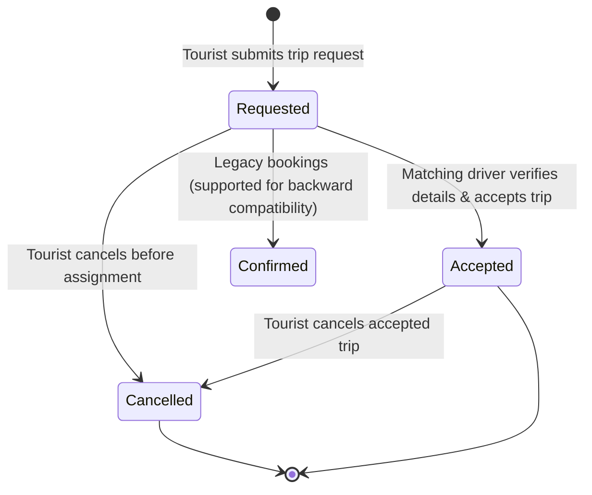

# Destination Paradise — System Architecture & Production Documentation

## 1. System Overview

Destination Paradise is a two-sided travel marketplace connecting **Tourists** seeking customized travel with verified **Van Drivers** offering vehicle capacity and regional route availability. The platform operates on a direct contact & matching model: tourists submit trip requests, available van drivers with matching seating capacity and scheduled calendar availability discover these requests, negotiate trip terms and pricing directly via telephone or WhatsApp, and lock in trips on the platform via atomic transactions.

---

## 2. Tech Stack & Dependencies

- **Runtime & Engine:** Node.js (>= 18.x, v24 tested)
- **Web Framework:** Express.js (v5.1.x)
- **Templating Engine:** EJS with server-side rendered layouts
- **Authentication:** Firebase Authentication (via Google Identity Toolkit REST API v1)
- **Database & Transactions:** Google Cloud Firestore (Firebase Admin SDK v13.x)
- **Session Management:** `express-session` with `cookie-parser`
- **Security & Protection:**
  - `helmet`: Content-Security-Policy, HSTS, X-Frame-Options, X-Content-Type-Options, Referrer-Policy
  - `csrf-csrf`: Double-submit HMAC CSRF token protection
  - `express-rate-limit`: Multi-tiered IP rate limiting (Auth and Action limiters)

---

## 3. Route Access Matrix

| Route | Method | Access Level | Description |
|---|---|---|---|
| `/` | `GET` | Public | Homepage, destination catalog, and booking submission form |
| `/login` | `GET`, `POST` | Public (Anonymous) | Tourist login (redirects authenticated users) |
| `/register` | `GET`, `POST` | Public (Anonymous) | Tourist account creation |
| `/logout` | `GET` | Authenticated | Destroys active session and clears session cookie |
| `/csrf-token` | `GET` | Public | Returns a fresh CSRF token for AJAX clients |
| `/dashboard` | `GET` | **Tourist Only** | Displays tourist's trip history, statuses, and assigned driver details |
| `/bookings` | `POST` | **Tourist Only** | Submits a new trip request with status `"Requested"` |
| `/cancel-booking/:id` | `POST` | **Tourist Only** | Cancels a pending or accepted trip request |
| `/driver/login` | `GET`, `POST` | Public (Anonymous) | Van Driver portal login |
| `/driver/register` | `GET`, `POST` | Public (Anonymous) | Van Driver account registration and profile initialization |
| `/driver/dashboard` | `GET` | **Driver Only** | Driver portal home: active status toggle, availability summary, match count |
| `/driver/profile` | `GET`, `POST` | **Driver Only** | Driver personal info, vehicle model, plate, seating capacity, experience |
| `/driver/toggle-active`| `POST` | **Driver Only** | Toggles driver `isActive` flag (pause/resume receiving trips) |
| `/driver/availability` | `GET`, `POST` | **Driver Only** | Views availability windows and adds a new date range |
| `/driver/availability/:id/update` | `POST` | **Driver Only** | Updates an existing availability window with overlap verification |
| `/driver/availability/:id/delete` | `POST` | **Driver Only** | Deletes an availability window |
| `/driver/availability/:id/toggle` | `POST` | **Driver Only** | Toggles window status between `available` and `unavailable` |
| `/driver/trips` | `GET` | **Driver Only** | Marketplace of open trip requests matching driver capacity and dates |
| `/driver/trips/:id/accept` | `POST` | **Driver Only** | Atomically accepts a trip request with concurrency and overlap validation |
| `/driver/my-trips` | `GET` | **Driver Only** | Driver's schedule of accepted trips (Upcoming & Past) with tourist contact info |

---

## 4. Firestore Collections & Schema Definitions

### Collection: `users`
Documents keyed by Firebase Authentication `uid`: `users/{uid}`
```json
{
  "uid": "string (Firebase UID)",
  "email": "string (normalized lowercase)",
  "role": "tourist" | "driver",
  "createdAt": "Timestamp",
  "updatedAt": "Timestamp"
}
```

### Collection: `drivers`
Documents keyed by Firebase Authentication `uid`: `drivers/{uid}`
```json
{
  "uid": "string (Firebase UID)",
  "name": "string",
  "email": "string",
  "phone": "string",
  "licenseNumber": "string",
  "vanModel": "string",
  "vanNumber": "string",
  "seatingCapacity": "number (4-20)",
  "experienceYears": "number (0-60)",
  "verificationStatus": "pending" | "verified" | "rejected",
  "isActive": "boolean",
  "createdAt": "Timestamp",
  "updatedAt": "Timestamp"
}
```

### Subcollection: `drivers/{uid}/availability`
Documents keyed by auto-generated document ID: `drivers/{uid}/availability/{availabilityId}`
```json
{
  "availabilityId": "string",
  "driverId": "string (Firebase UID)",
  "fromDate": "string (YYYY-MM-DD)",
  "toDate": "string (YYYY-MM-DD)",
  "status": "available" | "unavailable",
  "createdAt": "Timestamp",
  "updatedAt": "Timestamp"
}
```

### Collection: `bookings`
Documents keyed by auto-generated document ID: `bookings/{bookingId}`
```json
{
  "bookingId": "string",
  "touristId": "string (Session UID)",
  "destination": "string",
  "fromDate": "string (YYYY-MM-DD)",
  "toDate": "string (YYYY-MM-DD)",
  "people": "number (1-20)",
  "name": "string",
  "email": "string (Session Email)",
  "countryCode": "string (e.g. +91)",
  "phone": "string",
  "maritalStatus": "string (single | married)",
  "status": "Requested" | "Accepted" | "Cancelled" | "Confirmed (legacy)",
  "driverId": "string | null",
  "driverName": "string | null",
  "driverPhone": "string | null",
  "driverEmail": "string | null",
  "vanModel": "string | null",
  "vanNumber": "string | null",
  "seatingCapacity": "number | null",
  "bookedAt": "Timestamp",
  "acceptedAt": "Timestamp | null",
  "updatedAt": "Timestamp"
}
```

---

## 5. State Machine & Booking Lifecycle



### Lifecycle Rules:
1. **New Bookings**: Created with initial status `Requested`, `driverId: null`, and assigned driver vehicle fields set to `null`.
2. **Acceptance**: Drivers can only accept trips in `Requested` status. Once accepted, status transitions to `Accepted` atomically via Firestore transaction.
3. **Cancellation**: A tourist can cancel any of their own bookings whose status is not already `Cancelled`.
4. **Backward Compatibility**: Legacy `Confirmed` bookings remain viewable on dashboards and cannot be mutated by driver workflows.

---

## 6. Driver Availability & Overlap Prevention Logic

### Calendar Date Format
All dates are strictly normalized to `YYYY-MM-DD` strings. Standard lexicographical string comparison is valid: `dateA <= dateB`.

### Overlap Condition
Two date ranges `[FromA, ToA]` and `[FromB, ToB]` overlap if and only if:
```
FromA <= ToB AND ToA >= FromB
```

### Marketplace Discovery Rules
For an open trip request (`status == 'Requested'`) to be visible to a driver:
1. Driver must be active: `driver.isActive === true`
2. Vehicle capacity must accommodate trip passengers: `driver.seatingCapacity >= trip.people`
3. Driver must have a scheduled window with `status === 'available'` covering the entire trip:
   `trip.fromDate >= period.fromDate AND trip.toDate <= period.toDate`

### Concurrency & Transactional Acceptance
When a driver submits `POST /driver/trips/:id/accept`, an atomic `db.runTransaction` executes:
1. Verifies trip document exists and has `status === 'Requested'`.
2. Verifies driver exists and has `isActive === true`.
3. Verifies driver van capacity `seatingCapacity >= trip.people`.
4. Re-verifies driver's availability window still covers the trip dates.
5. Verifies driver has no overlapping accepted trip:
   Queries `bookings` where `driverId == driverUid` and `status == 'Accepted'`.
   Asserts `trip.fromDate <= existing.toDate && trip.toDate >= existing.fromDate` is false for all records.
6. Updates trip status to `Accepted` with driver and vehicle snapshot.

---

## 7. Security Architecture & Hardening

### 1. CSRF Protection
- Implemented via `csrf-csrf` (v4.x) using the Double-Submit Cookie pattern with cryptographic HMAC signing.
- Non-mutating methods (`GET`, `HEAD`, `OPTIONS`) are exempt.
- Token extractor supports both standard HTML form body (`req.body._csrf`) and AJAX header (`X-CSRF-Token`).
- Cookies are configured with `httpOnly: true`, `sameSite: "lax"`, and secured in production.

### 2. Rate Limiting
- **Auth Limiter**: 50 requests per 15-minute window for authentication endpoints (`/login`, `/register`, `/driver/login`, `/driver/register`).
- **Action Limiter**: 120 requests per 15-minute window for state-changing endpoints (`/bookings`, `/cancel-booking`, driver profile, availability, and trip acceptance).

### 3. Session Hardening
- Session identifier renamed to `dp.sid` to obscure framework fingerprinting.
- `req.session.regenerate()` is executed upon successful login and registration to mitigate Session Fixation attacks.
- Session cookie configured with `httpOnly: true`, `sameSite: 'lax'`, `maxAge: 86400000` (24 hours).

### 4. HTTP Headers (Helmet)
- Custom Content-Security-Policy (CSP):
  - Scripts: `'self'`, Google APIs (`identitytoolkit.googleapis.com`)
  - Styles: `'self'`, `'unsafe-inline'`, Google Fonts
  - Connect: `'self'`, `identitytoolkit.googleapis.com`
  - Deep-links: `tel:`, `https://wa.me/`
- Standard headers: `X-Content-Type-Options: nosniff`, `X-Frame-Options: SAMEORIGIN`, `Strict-Transport-Security`.

### 5. Input Sanitization & Validation
- Tourist bookings: String length limits (Destination <= 100, Name <= 100), phone regex (7-15 digits), ISO date format (`YYYY-MM-DD`), date ordering (`toDate > fromDate >= tomorrow`), passenger range (1-20).
- Driver profiles: Driver license <= 50, Van model <= 100, Plate <= 30, Seating capacity (4-20), Driving experience (0-60).

### 6. Duplicate Submission & Spam Protection
- **Client-Side**: Immediate button disablement with `"Submitting..."` indicator on form submission.
- **Server-Side**: 60-second duplicate trip window query prevents rapid identical bookings for the same user, destination, and dates.

### 7. Firestore Write Whitelisting
- Strict server-constructed write payloads. User-submitted request bodies are never passed directly to `collection.add()` or `doc.set()`.
- Tourist UID and email are strictly extracted from authenticated session tokens.

---

## 8. Production Deployment Guidelines

1. **Session Store**: In production environments with multiple instances or horizontal scaling, replace the default in-memory session store (`MemoryStore`) with a distributed session store such as `connect-redis` or `firestore-store`.
2. **HTTPS / Secure Cookies**: Ensure `cookie.secure = true` is active when deploying behind TLS/SSL reverse proxies (e.g. Nginx, Cloudflare, Google Cloud Run) and set `app.set("trust proxy", 1)`.
3. **Secrets Management**: Store `SESSION_SECRET`, `FIREBASE_API_KEY`, and service account credentials in secret managers (e.g. Google Cloud Secret Manager or AWS Secrets Manager) rather than committing files.
4. **Firestore Indexes**: Deploy `firestore.indexes.json` using the Firebase CLI (`firebase deploy --only firestore:indexes`) to avoid query throttling.

