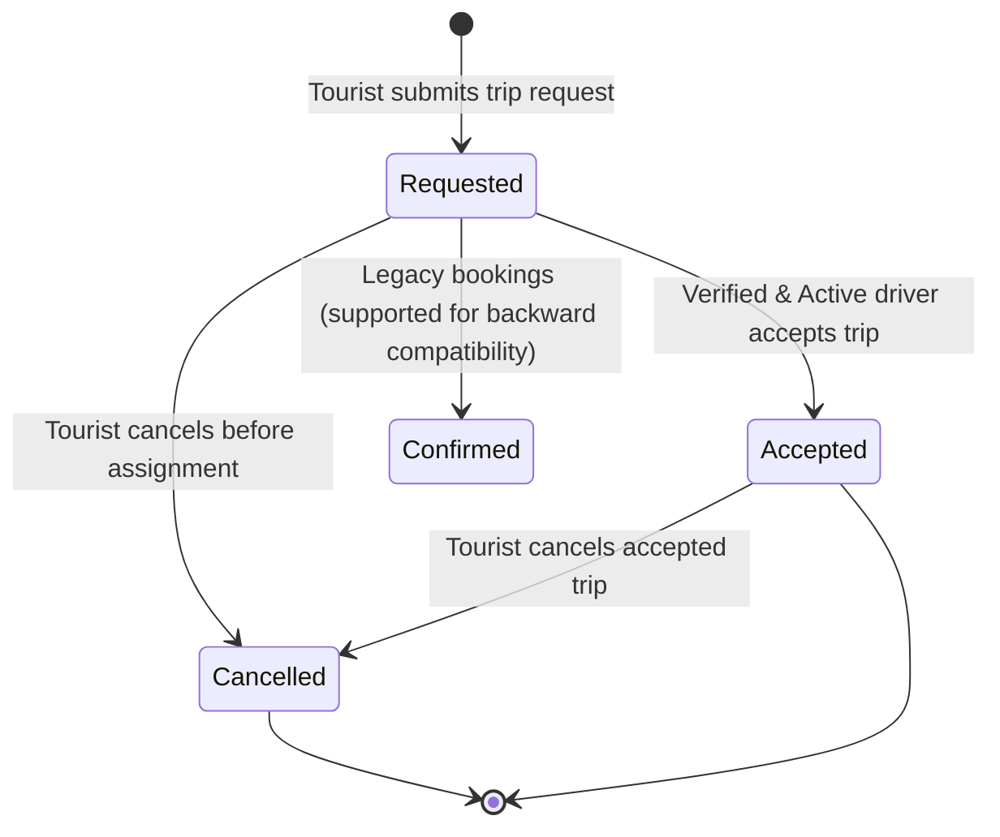

# Destination Paradise — System Architecture & Production Documentation

## 1. System Overview

Destination Paradise is a two-sided travel marketplace connecting **Tourists** seeking customized travel with verified **Van Drivers** offering vehicle capacity and regional route availability. The platform operates on a direct contact & matching model: tourists submit trip requests, verified van drivers with matching seating capacity and scheduled calendar availability discover these requests in real time, negotiate trip terms and pricing directly via telephone or WhatsApp, and lock in trips on the platform via atomic transactions.

An administrative governance layer (**Admin Portal**) provides supervisory controls, review and verification of driver applicants, active status management, and platform-wide monitoring.

---

## 2. Tech Stack & Dependencies

- **Runtime & Engine:** Node.js (>= 18.x, v24 tested)
- **Web Framework:** Express.js (v5.1.x)
- **Templating Engine:** EJS with server-side rendered layouts and shared partials
- **Authentication:** Firebase Authentication (via Google Identity Toolkit REST API v1)
- **Database & Transactions:** Google Cloud Firestore (Firebase Admin SDK v13.x)
- **Session Management:** `express-session` with `cookie-parser`
- **Security & Protection:**
  - `helmet`: Content-Security-Policy, HSTS, X-Frame-Options, X-Content-Type-Options, Referrer-Policy
  - `csrf-csrf`: Double-submit HMAC CSRF token protection
  - `express-rate-limit`: Multi-tiered IP rate limiting (Auth and Action limiters)

---

## 3. Route Access & Permission Matrix

| Route | Method | Access Level | Description |
|---|---|---|---|
| `/` | `GET` | Public | Homepage, destination catalog, and booking submission form |
| `/login` | `GET`, `POST` | Public (Anonymous) | Tourist/Admin login (redirects authenticated users) |
| `/register` | `GET`, `POST` | Public (Anonymous) | Tourist account creation |
| `/logout` | `GET` | Authenticated | Destroys active session and clears session cookie |
| `/csrf-token` | `GET` | Public | Returns a fresh CSRF token for AJAX clients |
| `/dashboard` | `GET` | **Tourist Only** | Displays tourist's trip history, statuses, and assigned driver details |
| `/bookings` | `POST` | **Tourist Only** | Submits a new trip request with status `"Requested"` |
| `/cancel-booking/:id` | `POST` | **Tourist Only** | Cancels a pending or accepted trip request |
| `/driver/login` | `GET`, `POST` | Public (Anonymous) | Van Driver portal login |
| `/driver/register` | `GET`, `POST` | Public (Anonymous) | Van Driver account registration and profile initialization |
| `/driver/dashboard` | `GET` | **Driver Only** | Driver portal home: active status toggle, availability summary, match count |
| `/driver/profile` | `GET`, `POST` | **Driver Only** | Driver personal info, vehicle model, plate, seating capacity, experience |
| `/driver/toggle-active`| `POST` | **Driver Only** | Toggles driver `isActive` flag (pause/resume receiving trips) |
| `/driver/availability` | `GET`, `POST` | **Driver Only** | Views availability windows and adds a new date range |
| `/driver/availability/:id/update` | `POST` | **Driver Only** | Updates an existing availability window with overlap verification |
| `/driver/availability/:id/delete` | `POST` | **Driver Only** | Deletes an availability window |
| `/driver/availability/:id/toggle` | `POST` | **Driver Only** | Toggles window status between `available` and `unavailable` |
| `/driver/trips` | `GET` | **Driver Only** | Marketplace of open trip requests matching driver capacity, dates, and verification |
| `/driver/trips/:id/accept` | `POST` | **Driver Only** | Atomically accepts a trip request with concurrency, overlap, and verification validation |
| `/driver/my-trips` | `GET` | **Driver Only** | Driver's schedule of accepted trips (Upcoming & Past) with tourist contact info |
| `/admin` | `GET` | **Admin Only** | Admin Dashboard: Operational metrics, pending review queue, recent activity |
| `/admin/drivers` | `GET` | **Admin Only** | Driver Directory: Paginated/filtered driver list (`pending`, `verified`, `rejected`, `active`, `inactive`) and search |
| `/admin/drivers/:id` | `GET` | **Admin Only** | Driver Review Page: Personal, credentials, vehicle specs, and audit trail |
| `/admin/drivers/:id/verify` | `POST` | **Admin Only** | Approves driver application (`verificationStatus: "verified"`). CSRF protected |
| `/admin/drivers/:id/reject` | `POST` | **Admin Only** | Rejects driver application (`verificationStatus: "rejected"`). CSRF protected |
| `/admin/drivers/:id/toggle-active` | `POST` | **Admin Only** | Toggles driver `isActive` status (preserves `verificationStatus`). CSRF protected |
| `/admin/trips` | `GET` | **Admin Only** | Platform Trips Monitor: Read-only tracking of all platform bookings |
| `/admin/users` | `GET` | **Admin Only** | Platform Users Registry: Read-only directory of all user accounts |

---

## 4. Firestore Collections & Schema Definitions

### Collection: `users`
Documents keyed by Firebase Authentication `uid`: `users/{uid}`
```json
{
  "uid": "string (Firebase UID)",
  "email": "string (normalized lowercase)",
  "role": "tourist" | "driver" | "admin",
  "promotedAt": "Timestamp | null",
  "createdAt": "Timestamp",
  "updatedAt": "Timestamp"
}
```

### Collection: `drivers`
Documents keyed by Firebase Authentication `uid`: `drivers/{uid}`
```json
{
  "uid": "string (Firebase UID)",
  "name": "string",
  "email": "string",
  "phone": "string",
  "licenseNumber": "string",
  "vanModel": "string",
  "vanNumber": "string",
  "seatingCapacity": "number (4-20)",
  "experienceYears": "number (0-60)",
  "verificationStatus": "pending" | "verified" | "rejected",
  "verificationUpdatedAt": "Timestamp | null",
  "verificationUpdatedBy": "string (Admin UID) | null",
  "isActive": "boolean",
  "activeStatusUpdatedAt": "Timestamp | null",
  "activeStatusUpdatedBy": "string (UID) | null",
  "createdAt": "Timestamp",
  "updatedAt": "Timestamp"
}
```

### Subcollection: `drivers/{uid}/availability`
Documents keyed by auto-generated document ID: `drivers/{uid}/availability/{availabilityId}`
```json
{
  "availabilityId": "string",
  "driverId": "string (Firebase UID)",
  "fromDate": "string (YYYY-MM-DD)",
  "toDate": "string (YYYY-MM-DD)",
  "status": "available" | "unavailable",
  "createdAt": "Timestamp",
  "updatedAt": "Timestamp"
}
```

### Collection: `bookings`
Documents keyed by auto-generated document ID: `bookings/{bookingId}`
```json
{
  "bookingId": "string",
  "touristId": "string (Session UID)",
  "destination": "string",
  "fromDate": "string (YYYY-MM-DD)",
  "toDate": "string (YYYY-MM-DD)",
  "people": "number (1-20)",
  "name": "string",
  "email": "string (Session Email)",
  "countryCode": "string (e.g. +91)",
  "phone": "string",
  "maritalStatus": "string (single | married)",
  "status": "Requested" | "Accepted" | "Cancelled" | "Confirmed (legacy)",
  "driverId": "string | null",
  "driverName": "string | null",
  "driverPhone": "string | null",
  "driverEmail": "string | null",
  "vanModel": "string | null",
  "vanNumber": "string | null",
  "seatingCapacity": "number | null",
  "bookedAt": "Timestamp",
  "acceptedAt": "Timestamp | null",
  "updatedAt": "Timestamp"
}
```

---

## 5. Driver Verification Lifecycle & Marketplace Matching

### Canonical Verification States:
1. `pending`: Initial status upon driver registration. The driver cannot match trips or accept bookings.
2. `verified`: Approved by an administrator. The driver can discover matching requests and accept bookings (provided `isActive === true`).
3. `rejected`: Rejected by an administrator. The driver is strictly barred from matching requests and accepting bookings.

### Production Marketplace Eligibility Matrix:
| Verification Status | Active Status | Marketplace Matching | Trip Acceptance |
|---|---|---|---|
| `verified` | `true` | **Eligible** | **Allowed** |
| `verified` | `false` | Not Eligible | Blocked (`DRIVER_INACTIVE`) |
| `pending` | `true` | Not Eligible | Blocked (`DRIVER_NOT_VERIFIED`) |
| `pending` | `false` | Not Eligible | Blocked (`DRIVER_INACTIVE`) |
| `rejected` | `true` | Not Eligible | Blocked (`DRIVER_REJECTED`) |
| `rejected` | `false` | Not Eligible | Blocked (`DRIVER_REJECTED`) |

---

## 6. Administrator Provisioning Security Model

- **No Public Registration:** There is no `/admin/register` endpoint. Normal user registration exclusively issues `role: "tourist"` (at `/register`) or `role: "driver"` (at `/driver/register`).
- **No Dynamic Promotion:** The server does not dynamically upgrade roles during normal login based on client-controlled parameters or simple email matching.
- **Server-Side CLI Utility:** System operators provision administrators via the CLI tool:
  ```bash
  node scripts/make-admin.js <email>
  ```
  The script initializes the Firebase Admin SDK, verifies the existence of the user record in `users/{uid}`, updates `role: "admin"`, and records `promotedAt`.
- **Role Verification on Login:** `POST /login` reads `userData.role` from Firestore. If `role === "admin"`, the session is populated with `role: "admin"` and redirected to `/admin`.
- **Server-Side Route Enforcement:** `requireAdmin` validates `req.session?.user?.role === "admin"`. Unauthenticated requests redirect to `/login`; unauthorized authenticated users (tourists, drivers) receive HTTP 403 Forbidden.

---

## 7. State Machine & Booking Lifecycle



### Lifecycle Rules:
1. **New Bookings**: Created with initial status `Requested`, `driverId: null`, and assigned driver vehicle fields set to `null`.
2. **Acceptance**: Drivers must be verified, active, have sufficient seating capacity, and have an active availability window covering the complete trip with no overlapping accepted trips. Concurrency is enforced via Firestore transaction.
3. **Cancellation**: A tourist can cancel any of their own bookings whose status is not already `Cancelled`.
4. **Backward Compatibility**: Legacy `Confirmed` bookings remain viewable on dashboards and cannot be mutated by driver workflows.

---

## 8. Audit Trails & Write Safety

Whenever an administrator alters driver verification or active status:
- `verificationUpdatedAt`: Recorded via `admin.firestore.FieldValue.serverTimestamp()`.
- `verificationUpdatedBy`: Populated strictly from the authenticated admin's session UID (`req.session.user.uid`).
- `activeStatusUpdatedAt`: Server timestamp of active status change.
- `activeStatusUpdatedBy`: Authenticated UID of the actor who updated active status.
- **Strict Whitelist Updates:** Updates are applied using explicit field object mappings (`driverRef.update({...})`). Spreading raw request bodies into Firestore is strictly prohibited.
